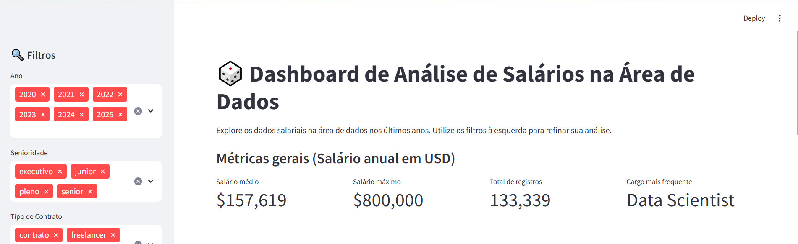
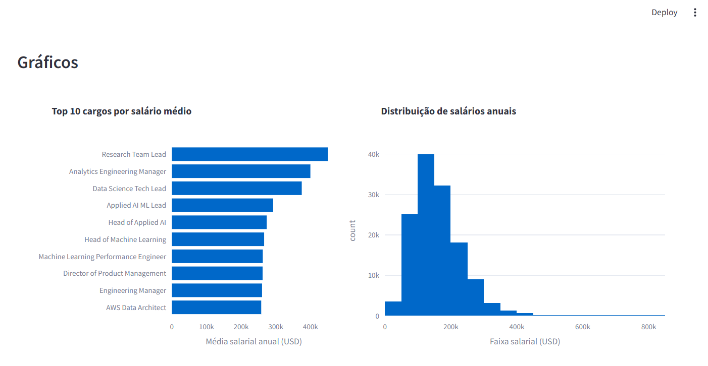
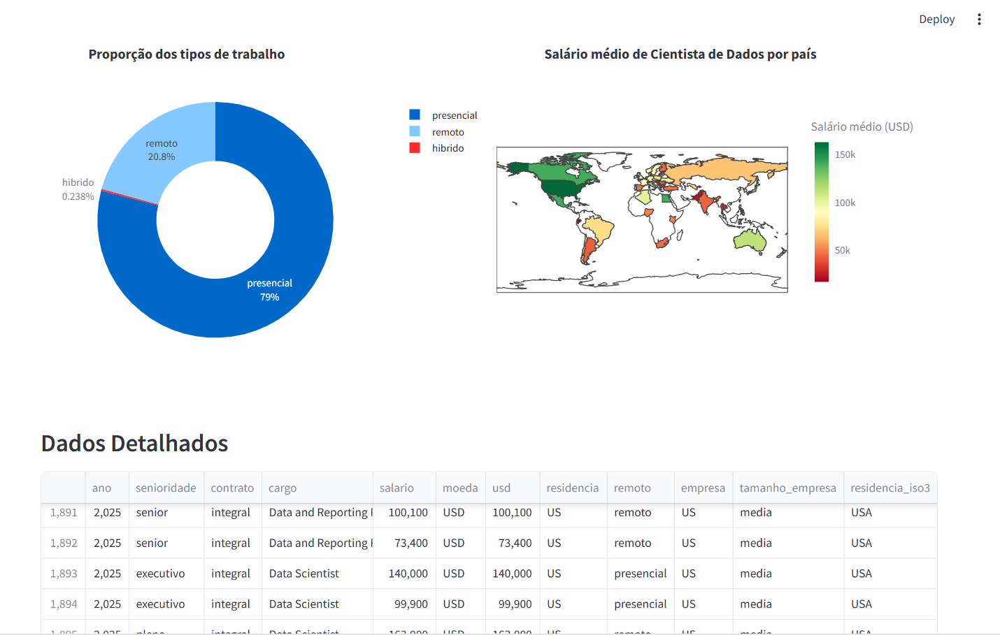

# 📊 Data Analysis with Python | Alura Immersion


---

# About the Project | Sobre o Projeto

**EN 🇬🇧**
This repository contains practical data analysis projects developed during the **Alura Data Immersion – Python Edition**. The project is structured as a **Data Analysis & Data Science portfolio**, focusing on data exploration, visualization, and insight generation using Python and Jupyter Notebooks.

**PT 🇧🇷 / 🇵🇹**
Este repositório reúne projetos práticos de análise de dados desenvolvidos durante a **Imersão de Dados com Python da Alura**. O projeto foi estruturado como um **portfólio de Análise de Dados e Data Science**, com foco em exploração de dados, visualização e geração de insights utilizando Python e Jupyter Notebooks.

---

## 🎯 Purpose | Objetivo

**EN**

* Apply Python for data analysis
* Perform exploratory data analysis (EDA)
* Visualize patterns and trends in data
* Strengthen a data-focused portfolio

**PT**

* Aplicar Python na análise de dados
* Realizar análise exploratória de dados (EDA)
* Visualizar padrões e tendências
* Fortalecer um portfólio focado em dados

---

## 🧠 Skills Demonstrated | Competências Demonstradas

**EN**

* Python for data analysis
* Exploratory Data Analysis (EDA)
* Data cleaning and preprocessing
* Data visualization with Python libraries
* Analytical thinking and insight generation
* Use of Jupyter Notebooks for data projects

**PT**

* Python aplicado à análise de dados
* Análise Exploratória de Dados (EDA)
* Limpeza e preparação de dados
* Visualização de dados com bibliotecas Python
* Pensamento analítico e geração de insights
* Uso de Jupyter Notebooks em projetos de dados

---

##  Repository Structure | Estrutura do Repositório

```
data-analysis-python-alura/
│
├── app.py
├── dados-mersao-final.csv
├── requirements.txt
└── README.md
```

---

## App Features | Funcionalidades da Aplicação

EN

Interactive dashboard built with Streamlit

Dynamic filters by year, seniority, contract type, and work model

Real-time calculation of key salary metrics

Advanced data visualizations (bar charts, histograms, donut charts, choropleth map)

Global salary comparison by country

Fully transparent data table with filtered records

PT

Dashboard interativo desenvolvido com Streamlit

Filtros dinâmicos por ano, senioridade, tipo de contrato e modelo de trabalho

Cálculo em tempo real das principais métricas salariais

Visualizações avançadas (gráficos de barras, histogramas, gráfico em rosca e mapa coroplético)

Comparação global de salários por país

Tabela de dados completa e transparente com registros filtrados

---

## Requirements | Requisitos

**EN**

* Python 3.9 or higher
* Jupyter Notebook or Google Colab
* Required Python libraries listed in `requirements.txt`

**PT**

* Python 3.9 ou superior
* Jupyter Notebook ou Google Colab
* Bibliotecas Python listadas no arquivo `requirements.txt`

### Installing Dependencies | Instalando Dependências

**EN**
It is recommended to install the project dependencies using the `requirements.txt` file:

```bash
pip install -r requirements.txt
```

This ensures that all required libraries and compatible versions are installed.

**PT**
Recomenda-se instalar as dependências do projeto utilizando o arquivo `requirements.txt`:

```bash
pip install -r requirements.txt
```

Isso garante que todas as bibliotecas necessárias e versões compatíveis sejam instaladas.

---

## ▶️ How to Run | Como Executar

**EN**

1. Clone the repository:

```bash
git clone https://github.com/ezequielcabeja/data-analysis-python-alura.git
```

2. Navigate to the project folder:

```bash
cd data-analysis-python-alura
```

3. Install the dependencies:

```bash
pip install -r requirements.txt
```

### ▶️ Running the Application (Streamlit)

4. Run the Streamlit app:

```bash
streamlit run app.py
```

5. Open the local URL shown in the terminal (usually `http://localhost:8501`) to interact with the application.

---

**PT**

1. Clone o repositório:

```bash
git clone https://github.com/ezequielcabeja/data-analysis-python-alura.git
```

2. Acesse a pasta do projeto:

```bash
cd data-analysis-python-alura
```

3. Instale as dependências:

```bash
pip install -r requirements.txt
```

### ▶️ Executando a Aplicação (Streamlit)

4. Execute a aplicação Streamlit:

```bash
streamlit run app.py
```

5. Abra o endereço local exibido no terminal (normalmente `http://localhost:8501`) para interagir com a aplicação.

---

## Key Visualizations | Gráficos e Insights Principais

**EN 🇬🇧**
This section highlights the most relevant visualizations generated during the analysis. These charts demonstrate the ability to explore data, identify patterns, and communicate insights effectively.

**PT 🇧🇷 / 🇵🇹**
Esta seção destaca as visualizações mais relevantes geradas durante as análises. Os gráficos demonstram a capacidade de explorar dados, identificar padrões e comunicar insights de forma clara.
Dashboard Overview – Filters & Key Metrics

**EN**
This main dashboard provides an interactive overview of salary data in the Data field. Users can filter results by year, seniority level, and contract type to dynamically update all metrics and visualizations. Key indicators such as average salary, maximum salary, total records, and most frequent job role allow for quick, high-level insights.

**PT**
Este painel principal apresenta uma visão geral interativa dos dados salariais na área de Dados. Os utilizadores podem filtrar os resultados por ano, senioridade e tipo de contrato, atualizando dinamicamente todas as métricas e visualizações. Indicadores-chave como salário médio, salário máximo, total de registros e cargo mais frequente permitem insights rápidos e estratégicos.



Salary Analysis – Top Roles & Distribution

**EN**
This section highlights the top 10 job roles by average annual salary, enabling comparison between high-paying positions in the Data industry. Alongside, the salary distribution histogram reveals concentration ranges, salary spread, and the presence of high-end outliers, offering a deeper understanding of compensation patterns.

**PT**
Esta seção destaca os 10 cargos com maior salário médio anual, permitindo a comparação entre posições mais bem remuneradas na área de Dados. Em conjunto, o histograma de distribuição salarial revela faixas de concentração, dispersão dos salários e a presença de outliers, proporcionando uma compreensão mais profunda dos padrões de remuneração.



Work Model & Global Salary Comparison

**EN**
The donut chart illustrates the proportion of work models (on-site, remote, and hybrid), revealing workforce trends in the Data sector. The global map complements this view by displaying the average salary of Data Scientists by country, enabling geographic comparisons and identifying regions with higher compensation levels.

**PT**
O gráfico em rosca apresenta a proporção dos modelos de trabalho (presencial, remoto e híbrido), evidenciando tendências do mercado na área de Dados. O mapa global complementa a análise ao mostrar o salário médio de Cientistas de Dados por país, permitindo comparações geográficas e a identificação de regiões com maior remuneração.



Detailed Dataset View

**EN**
This table provides access to the complete, filtered dataset used in the analysis. Users can explore individual records including year, seniority, job role, salary, currency, country of residence, company size, and work model, ensuring transparency and supporting deeper, data-driven exploration.

**PT**
Esta tabela apresenta o conjunto de dados completo, já filtrado conforme as seleções do utilizador. É possível explorar registros individuais com informações como ano, senioridade, cargo, salário, moeda, país de residência, tamanho da empresa e modelo de trabalho, garantindo transparência e permitindo análises mais aprofundadas.
---

## Datasets Used | Conjuntos de Dados Utilizados

**EN**

* Public and educational datasets provided during the Alura Data Immersion
* Structured datasets suitable for exploratory data analysis

**PT**

* Datasets públicos e educacionais disponibilizados durante a Imersão de Dados da Alura
* Conjuntos de dados estruturados para análise exploratória

---

## 👤 Author | Autor

Developed by / Desenvolvido por:
**[Ezequiel Tchimbaya Cachapeu Paulo]**

---

## License | Licença

**EN**
This project is intended for **educational and portfolio purposes**.

**PT**
Este projeto é destinado a **fins educacionais e de portfólio**.

---

⭐ If this repository helped you, consider giving it a star!
⭐ Se este repositório te ajudou, considera deixar uma estrela!
